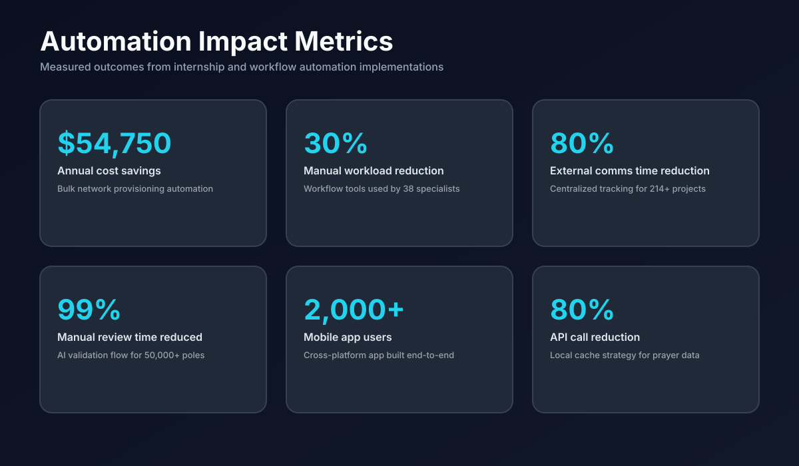
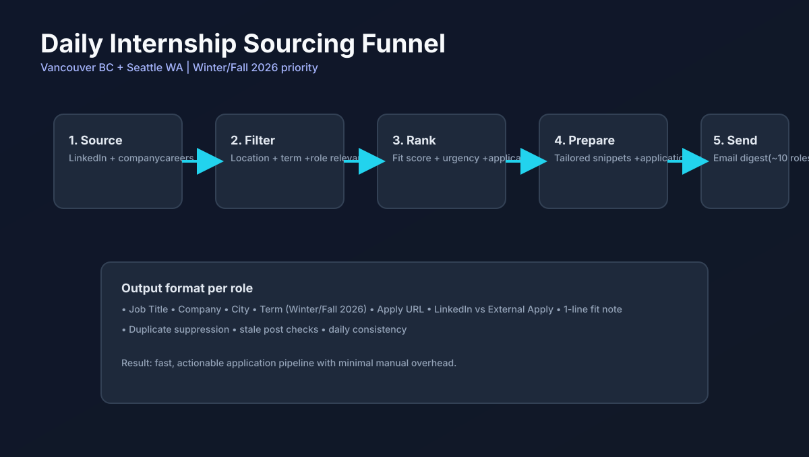
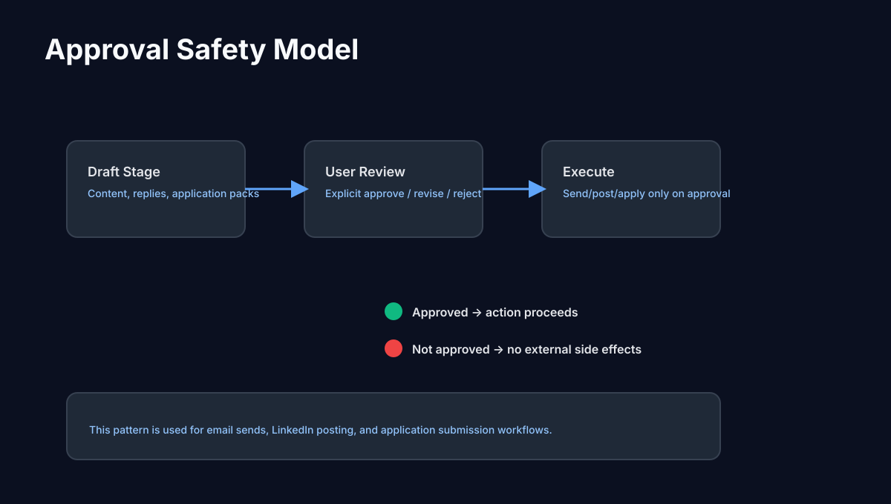
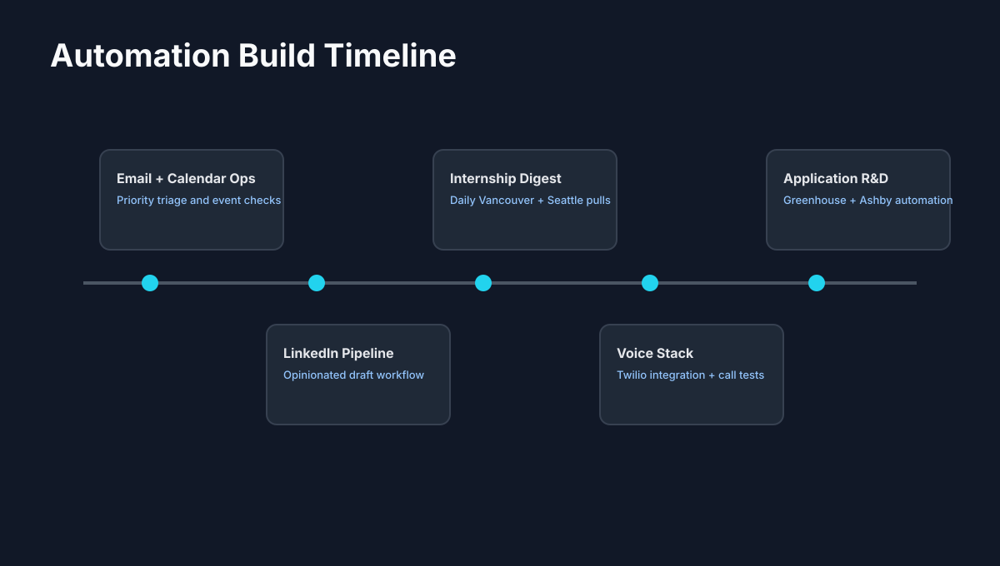

# 🦞 OpenClaw Automation Showcase

> A practical, real-world automation portfolio by Abdulrahman Al Odat.


---

## ✨ What this repo demonstrates

This repo documents end-to-end AI-assisted operations built with OpenClaw across:

- **Email intelligence** (priority detection, summaries, tailored drafts)
- **Calendar awareness** (upcoming-event visibility and prep prompts)
- **LinkedIn workflow** (news-driven, opinionated content drafting)
- **Internship sourcing pipeline** (daily role discovery + digest delivery)
- **Voice automation** (Twilio setup + interactive flow prototyping)
- **Application automation R&D** (Greenhouse/Ashby autofill engine)

The operating principle: automate heavy execution while keeping high-impact external actions approval-gated.

---

## 🧠 Architecture


---

## 📊 Impact section (with metrics)



### Key numbers

- **$54,750 annual savings** from provisioning automation
- **30% manual workload reduction** across internal specialist workflows
- **80% external communication reduction** via centralized tracking
- **99% manual review-time reduction** on AI-assisted validation
- **50,000+ records processed** in data/validation workflows
- **2,000+ app users** and **80% API-call reduction** in mobile product work

More details: [`docs/impact-metrics.md`](docs/impact-metrics.md)

---

## 🔁 Automation visuals

### Daily internship sourcing system



### Approval-safe execution model



### Build progression timeline



### Workflow map


---

## 🧩 Major workflow modules

### 1) Important email monitoring

- Scans unread inbox for high-signal items
- Drafts natural, human-sounding responses
- Sends only with explicit approval

### 2) LinkedIn content pipeline

- Pulls current AI/agent/job-market signals
- Drafts posts in a personal voice
- Uses scheduled cadence + approval before publish

### 3) Internship discovery (Vancouver + Seattle)

- Pulls around 10 internship opportunities/day
- Prioritizes **Winter/Fall 2026** terms
- Delivers digest with direct links + fit notes via email

### 4) Voice automation stack

- Twilio integration and number provisioning
- Programmatic outbound calling
- Interactive flow experiments for future real-time agent voice

### 5) Application automation research

- Reusable profile-based autofill for Greenhouse/Ashby
- Dry-run + submit modes
- Dynamic form handling and safety checks

---

## 📁 Repository structure

```text
openclaw-automation-showcase/
├── README.md
├── docs/
│   ├── automations.md
│   ├── design-principles.md
│   ├── impact-metrics.md
│   └── roadmap.md
└── assets/
    ├── architecture-overview.svg
    ├── impact-kpis.svg
    ├── internship-funnel.svg
    ├── approval-safety.svg
    ├── automation-timeline.svg
    └── workflow-map.svg
```

---

## 🎯 Design principles

1. **Human-in-the-loop first** for irreversible/public actions
2. **High automation, low risk** through explicit approval gates
3. **Concise actionable outputs** over noisy notifications
4. **Reusable building blocks** via skills + templates + scripts
5. **Measurable outcomes** as the success benchmark

---

## 🚀 Why this portfolio matters

This is not prompt demos. It is operations engineering with AI agents:

- orchestration
- API integrations
- scheduling
- communication pipelines
- execution controls
- outcome tracking

It shows how AI becomes a practical execution layer for real daily work.

---

If you're building practical AI operations too, feel free to fork and adapt.
