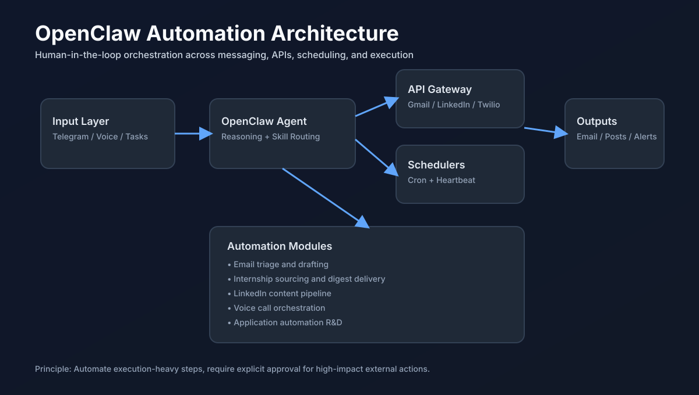
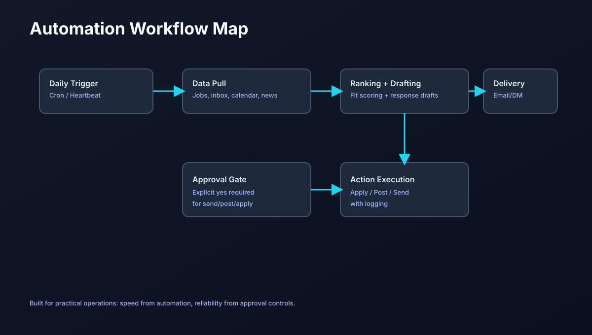

# 🦞 OpenClaw Automation Showcase

> A practical, real-world collection of automations I built with OpenClaw.


---

## ✨ What this repo demonstrates

This repo documents automation systems I designed and ran using OpenClaw across:

- **Email operations** (triage, summaries, approval-first drafting)
- **Calendar intelligence** (upcoming-event awareness)
- **LinkedIn workflow** (news-based post drafting with human tone)
- **Internship sourcing pipeline** (daily role discovery + delivery)
- **Voice calling experiments** (Twilio setup + interactive call flow)
- **Job-application automation R&D** (Greenhouse/Ashby autofill framework)

The goal is simple: build practical AI-assisted operations that save time while keeping human approval in control of final actions.

---

## 🧠 Core automation architecture



Key design principle:

- **Automate heavy work**
- **Keep high-stakes actions approval-gated**

---

## 🔁 Major workflows

### 1) Important email monitoring

- Daily scans for priority inbox items
- Human-sounding draft replies
- No outbound send without explicit approval

### 2) LinkedIn content pipeline

- Tech/news scanning (AI, agents, market signals)
- Opinionated, personal-tone drafts
- Scheduled cadence with manual post approval

### 3) Internship discovery (Vancouver + Seattle)

- Pull focused internship opportunities
- Prioritize Winter/Fall 2026 terms
- Deliver digests with links + fit notes

### 4) Voice automation prototype

- Twilio free-tier setup and number provisioning
- Call initiation and interactive flow testing
- Foundation for future real-time conversational agent

---

## 🖼️ Workflow visual



---

## 📁 Repository structure

```text
openclaw-automation-showcase/
├── README.md
├── docs/
│   ├── automations.md
│   ├── design-principles.md
│   └── roadmap.md
└── assets/
    ├── architecture-overview.svg
    └── workflow-map.svg
```

---

## 🎯 Design principles

1. **Human-in-the-loop first** for external/public actions
2. **Task batching** to reduce operational overhead
3. **High signal updates** over noisy notifications
4. **Reusability** via skills, templates, and repeatable scripts
5. **Operational clarity** with explicit schedules and outputs

---

## 🚀 Why this matters

This project is a concrete example of turning AI from a chat tool into an **operations layer** for daily execution.

It combines:

- agent orchestration
- messaging workflows
- API integrations
- scheduling
- approval-safe automation

---

## 📌 Next upgrades

- richer job intelligence scoring
- stricter application success verification
- more robust browser automation abstractions
- improved reporting dashboards

---

If you’re building practical AI workflows too, feel free to fork and adapt.
